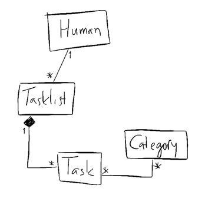
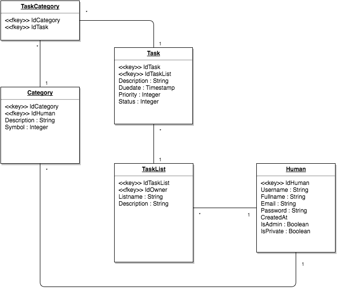

# askare
/ˈɑskɑreˣ/
1. A chore (daily routine task), normally used in plural (askaret or askareet)

## 1. Johdanto
Askare on helppokäyttöinen usean käyttäjän muistilistaohjelma, johon voit lisätä ja luokitella erilaisia tehtäviä asioita (askareita). 
Olemassaolevia askareita voi uudelleenluokitella ja priorisoida, niille voi antaa deadlinen, kuitata aloitetuiksi/tehdyiksi ja lopulta
arkistoida. Myöhemmissä versioissa tehtävälistoja voi myös jakaa toisille käyttäjille.

Ohjelma soveltuu esimerkiksi yksityishenkilöiden muistikirjaksi, perheiden taloudenpitoon ja pienille projekteille.

Järjestelmä on toteutettu PHP:lla Apache-palvelimelle ja käyttää tietokantanaan PostgreSQL:ää. Askare vaatii selaimelta Javascript-tuen.

## 2. Yleiskuva järjestelmästä
Tavallinen käyttäjä voi luoda, katsella, muokata ja poistaa omia tehtäviään. Tehtävät, kategoriat ja listat ovat henkilökohtaisia.

Pääkäyttäjä* voi lisäksi selata muita käyttäjiä ja esimerkiksi palauttaa toisen käyttäjän salasanan. 

*Huom. Pääkäyttäjän erityisoikeuksia ei ole vielä toteutettu palautusversiossa*.

* Kuva 1. Käyttötapaukset.

### Käyttötapausesimerkkejä

Lenni Latva-Laho, viherkasvien kauhu, kuulee järjestelmästä ensimmäistä kertaa sosiaalisessa mediassa ja arvelee sen soveltuvan mainiosti arkipäiväisten 
asioiden muistamiseen. Lenni surffaa aloitussivulle, luo uuden käyttäjätunnuksen ja saa vahvistuslinkin sähköpostitse. Hän luo ensimmäisen askareensa, 
”kastele kukat”, ja asettaa sen deadlineksi seuraavan keskiviikon prioriteetilla Erittäin Tärkeä. Nyt Lenni muistaa kerrankin kastella kukkasensa ja ne kukoistavat.

Ville Väärinkäyttäjä ei piittaa ohjelman tekijän tarkoitusperistä, vaan käyttää sitä autobiografista levykokoelmaansa varten. Ville pitää ohjelman luokittelu- 
ja järjestelyominaisuuksista, ja merkitsee jokaisen rakkaan vinyylilevynsä omaksi ”tehtäväkseen”, nimeää kategoriat genrejen mukaan ja käyttää deadlinea
hankkimispäivämäärän muistamiseen. Villeä ei haittaa, että ohjelmaa ei missään tapauksessa ole suunniteltu levykokoelman ylläpitoon.

### Järjestelmän tietosisältö

*Kuva 2. Käsitekaavio*

#### Tietokohde: Human

| Attribuutti | Arvojoukko   | Kuvaus
| -------     | -----------  | ------------------------------------  |
| Username    | varchar(20)  | Käyttäjätunnus                        |
| Fullname    | varchar(100) | Koko nimi (näkyy muille käyttäjille)  |
| Password    | varchar(255) | Salasana                              |
| Email       | varchar(254) | Sähköpostiosoite aktivointia varten   |
| IsPrivate   | boolean      | Piilotetaanko käyttäjä ystävähausta   |
| IsAdmin     | boolean      | Pääkäyttäjä (voi muokata käyttäjiä)   |

Järjestelmän käyttäjä, joka kirjautuu käyttäjätunnuksella/sähköpostiosoitteella ja salasanalla. Salasana kryptataan tietokantaan.

#### Tietokohde: TaskList

| Attribuutti | Arvojoukko   | Kuvaus
| -------     | ------------ | ---------------  |
| Name        | varchar(50)  | Listan nimi      |
| Description | varchar(200) | Listan kuvaus    |

Tehtävälista. Käyttäjä voi luoda useita tehtävälistoja, joista jokainen voi sisältää useita tehtäviä. 

#### Tietokohde: Task

| Attribuutti   | Arvojoukko    | Kuvaus
| -------       | -----------   | ---------------
| Description   | varchar(50)   | Tehtävän nimi
| Description   | varchar(2000) | Tehtävän tarkempi kuvaus
| Duedate       | timestamp     | Tehtävän deadline
| Completed     | timestamp     | Milloin tehtävä on merkitty suoritetuksi
| Priority      | integer       | Tehtävän tärkeysaste (Low...Highest)
| Repeat        | integer       | Tehtävän toistuvuus
| Status        | integer       | Ei aloitettu / aloitettu / Suoritettu
| Archived      | boolean       | Tehtävä on arkistossa
| Deleted       | boolean       | Tehtävä on roskakorissa

Tehtävälistan alkio eli suoritettava tehtävä. Tehtävälle voi asettaa prioriteetin (Low, **Normal**, High, Highest) ja useita luokkia.
Deadline ilmaistaan jäljelläolevana aikana, mutta sen määrittäminen ei ole pakollista. Tehtävä voidaan merkitä aloitetuksi ja suoritetuksi,
sekä siirtää arkistoon. Deleted-bitti on tarkoitettu soft deleten (roskakorin) toteuttamista varten.

Completed ja repeat ovat valmiina tulevia ominaisuuksia varten: tehtäviä voi vastaisuudessa asettaa toistuviksi tiettyinä viikonpäivinä ja
arkistoa selata kuukausinäkymän avulla. 

#### Tietokohde: Category

| Attribuutti   | Arvojoukko   | Kuvaus
| -------       | -----------  | ---------------  |
| Name          | varchar(50)  | Kategorian nimi
| Description   | varchar(200) | Kategorian kuvaus
| Symbol        | varchar(20)  | Kategorian tunnus (glyphicon)
| Color         | varchar(20)  | Kategorian väri (bootstrap)

Tehtävälle annettava luokittelumääre, joita voi olla useita per tehtävä. Luokittelumääreet ovat käyttäjäkohtaisia. Kategoriaa ilmaiseva symboli ja väri valitaan annetusta kirjastosta.

*Kuva 3. Tietokantakaavio*

### Järjestelmän yleisrakenne

Tietokantasovelluksessa on noudatettu MVC-mallia. Kontrollerit, näkymät ja mallit
sijaitsevat hakemistoissa /app/controllers, /app/views ja /app/models. GET ja POST -pyyntöjen ohjaamisesta kontrollereille vastaa /config -hakemistossa sijaitseva *routes.php*.

Ulkopuoliset kirjastot (esim. Bootstrap) sijaitsevat hakemistossa /vendor. Sovellus käyttää päivämäärän valintaan Jonathan Petersonin [Bootstrap Datetimepickeriä](https://github.com/Eonasdan/bootstrap-datetimepicker).

Kaikki tiedostonimet on kirjoitettu pienellä ja koodin luettavuuteen on pyritty kiinnittämään huomiota.

*Kuva 4. Järjestelmän komponentit*

### Järjestelmän käyttöohje

#### Staattiset sivut

Järjestelmän etusivu sijaitsee osoitteessa [http://milo.users.cs.helsinki.fi/askare]. Kirjautumalla pääset etusivunäkymään, josta näkee todo-listat ja niiden sisältämät tehtävät. Tehtävien kategoriat ilmaistaan värillisellä symbolilla, jota klikkaamalla näytetään kaikki saman kategorian tehtävät omana listanaan. Uusia tehtäviä, kategorioita ja listoja voi luoda yläpalkin New-alasvetovalikosta.